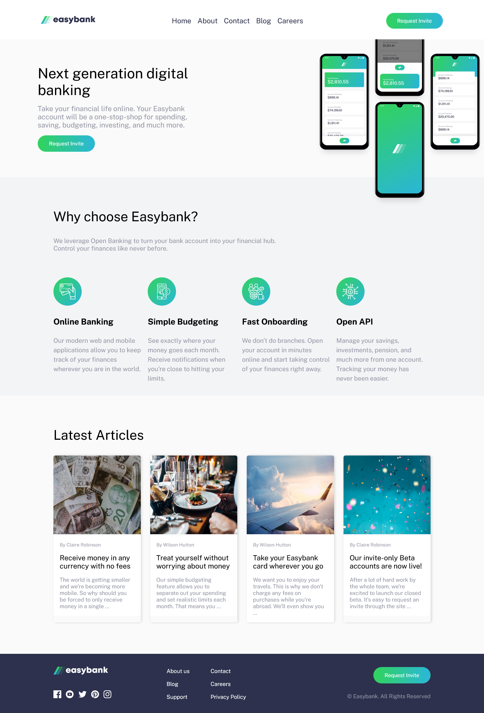

## Table of contents

- [Overview](#overview)
  - [The challenge](#the-challenge)
  - [Screenshot](#screenshot)
  - [Links](#links)
- [My process](#my-process)
  - [Built with](#built-with)
  - [What I learned](#what-i-learned)
  - [Continued development](#continued-development)

- [Author](#author)

## Overview

### The challenge

Users should be able to:

- View the optimal layout for the site depending on their device's screen size
- See hover states for all interactive elements on the page
- EXTRA - generate as much content using handlebars

### Screenshot

### Links

- Solution URL: [FEM - monte-dev](https://www.frontendmentor.io/solutions/easybank-landing-page-scss-js-handlebars-Jqo9Vd4v_q)
- Repo URL: [monte-dev](https://github.com/monte-dev/7-easybank-landing-page)
- Live Site URL: [@githubpages](https://monte-dev.github.io/7-easybank-landing-page/)

## My process

In coding this layout I decided to practice SCSS and handlebars. I have began by concentrating on generating content from data.json file using handlebars.

Then I proceeded to design the site by tackling each section at a time and completing both mobile and desktop version before moving on to the next section.

### Built with

- Semantic HTML5 markup
- SCSS
- Flexbox
- Handlebars templates
- Js fetch to display data from .json file
- Javascript for display of data and minor button actions

### What I learned

I have learned how to use SCSS in a project larger than a simple component. This knowledge will help me tremendously as SCSS brings a lot of advantages, especially in structuring the layout styles.

### Continued development

I want to expand my knowledge of BEM principles and continue using SCSS as I have found it extremely useful when working on layouts.

## Author

- Website - [Github](https://github.com/monte-dev)
- Frontend Mentor - [@monte-dev](https://www.frontendmentor.io/profile/monte-dev)
